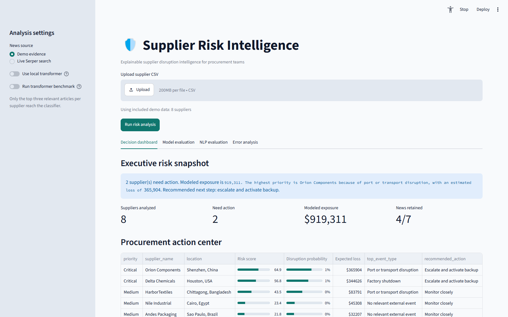
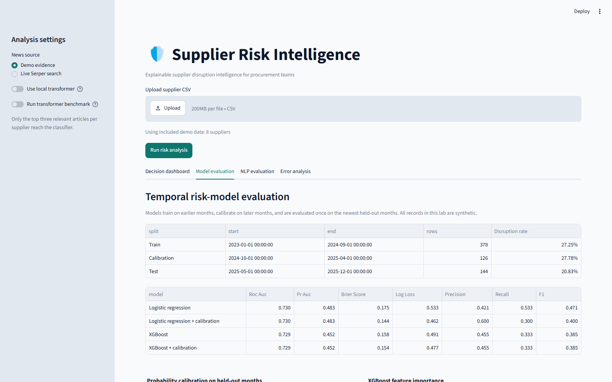
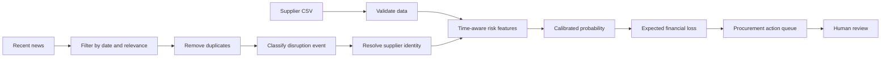

<h1 align="center">Supplier Risk Intelligence</h1>

<p align="center">
  A decision-support system that turns supplier performance and disruption news into a ranked, explainable procurement action queue.
</p>

<p align="center">
  
  
  
  
</p>


## The problem

Procurement teams often have supplier metrics in one place and disruption news in another. A risk
score alone does not answer what matters: **which supplier needs attention, why, how much is at
stake, and what should happen next?**

Supplier Risk Intelligence joins those signals and presents the evidence behind every alert. The
included demo runs without an API key or model download.

| Input | Analysis | Decision output |
|---|---|---|
| Supplier delays, quality, exposure, backup capacity | News filtering, event classification, entity matching, calibrated risk model | Priority, disruption probability, expected loss, evidence, recommended action |

## Product walkthrough

### Decision dashboard

The dashboard ranks suppliers by business impact instead of showing disconnected model scores.



### Model evaluation

The evaluation view makes the train, calibration, and test periods visible and compares model
quality on held-out future months.



## How it works



The expensive transformer is not run across every article. Date, keyword, relevance, and duplicate
filters run first; only the top three articles for each supplier reach the classifier. This keeps
the workflow practical as news volume grows.

## What is implemented

| Area | Implementation | Tools |
|---|---|---|
| News dataset | 64 labeled examples, 8 balanced disruption classes, fixed splits | CSV, pandas |
| NLP benchmark | TF-IDF baseline versus zero-shot DeBERTa | scikit-learn, Transformers |
| Entity resolution | Exact, alias, fuzzy-name, and location matching | String scoring, pandas |
| Risk features | Lag, rolling-window, trend, and seasonal features using only past rows | pandas, NumPy |
| Model comparison | Chronological logistic regression versus XGBoost | scikit-learn, XGBoost |
| Probability quality | Independent sigmoid calibration, reliability plots, Brier score, log loss | scikit-learn, Plotly |
| Explanations | Held-out SHAP importance plus false-positive and false-negative review | SHAP, pandas |
| Decision interface | Risk ranking, expected loss, evidence, actions, and CSV export | Streamlit, Plotly |
| Quality checks | Unit tests, linting, and GitHub Actions | pytest, Ruff |

## Measured demo results

All benchmark data is synthetic. These numbers show the evaluation design, not production model
performance.

### Disruption-news classification

| Model | Test articles | Accuracy | Macro F1 | Approx. CPU latency/article |
|---|---:|---:|---:|---:|
| TF-IDF n-grams + logistic regression | 16 | 0.500 | 0.467 | 1-2 ms |
| DeBERTa-v3-xsmall zero-shot | 16 | **0.750** | **0.729** | ~6.8 s |

### Supplier entity resolution

| Method | Precision | Recall | F1 | Test errors |
|---|---:|---:|---:|---:|
| Exact normalized name | 0.500 | 0.250 | 0.333 | 4 |
| Alias + fuzzy name + location | **1.000** | **0.500** | **0.667** | **2** |

### Future disruption risk

| Model | ROC-AUC | PR-AUC | Brier score | Recall |
|---|---:|---:|---:|---:|
| Logistic regression | **0.730** | **0.483** | 0.175 | **0.533** |
| Logistic + calibration | **0.730** | **0.483** | **0.144** | 0.300 |
| XGBoost | 0.724 | 0.443 | 0.154 | 0.333 |
| XGBoost + calibration | 0.724 | 0.443 | 0.151 | 0.300 |

Calibration improved probability accuracy for logistic regression, but lowered recall at the
default `0.5` threshold. In a real deployment, that threshold should reflect the cost of missed
disruptions and the team's capacity to investigate alerts.

Read the [full evaluation and error analysis](docs/evaluation_report.md) or the
[news-labeling guide](docs/news_annotation_guide.md).

## Run locally on Windows

From Command Prompt inside the project folder:

```bat
python -m venv .venv
.venv\Scripts\python.exe -m pip install -r requirements-dev.txt
.venv\Scripts\python.exe -m streamlit run app.py
```

Open `http://localhost:8501` and select **Run risk analysis**. Demo evidence and supplier data are
included, so the first run needs no account or API key.

### Optional transformer

```bat
.venv\Scripts\python.exe -m pip install -r requirements-ai.txt
.venv\Scripts\python.exe -m experiments.run_news_benchmark --transformer
```

The first transformer run downloads the public model
`MoritzLaurer/deberta-v3-xsmall-zeroshot-v1.1-all-33`. The model is loaded only when requested and
cached afterward.

### Optional live news

Choose **Live Serper search** in the sidebar and enter a Serper API key for the current session. The
app does not write the key to disk. Public portfolio deployments should keep demo evidence as the
default so visitors cannot consume the owner's quota.

## Reproduce the experiments

```bat
.venv\Scripts\python.exe -m experiments.run_news_benchmark
.venv\Scripts\python.exe -m experiments.run_entity_benchmark
.venv\Scripts\python.exe -m experiments.run_risk_benchmark
.venv\Scripts\python.exe -m experiments.run_risk_benchmark --shap
```

## Repository structure

```text
supplier-risk-intelligence/
|-- app.py                       Streamlit application
|-- supplyshield/                Analysis and decision logic
|-- experiments/                 Reproducible benchmark commands
|-- data/                        Demo and labeled datasets
|-- tests/                       Unit and integration tests
|-- docs/                        Evaluation notes and README assets
|-- .github/workflows/           Automated test and lint checks
|-- requirements.txt             Lightweight deployment dependencies
|-- requirements-ai.txt          Optional transformer dependencies
`-- Dockerfile                   Container deployment
```

The internal Python package remains `supplyshield` so existing imports stay stable. The product and
repository name is `supplier-risk-intelligence`.

## Supplier CSV

| Required column | Meaning |
|---|---|
| `supplier_id` | Stable unique identifier |
| `supplier_name` | Supplier display name |
| `location` | Supplier city, port, or country |
| `avg_delay_days` | Recent average delivery delay |
| `risk_score` | Existing internal risk measure from 0 to 100 |
| `daily_revenue_exposure` | Revenue potentially affected each day |

Optional fields include `aliases`, `on_time_delivery_rate`, `quality_defect_rate`,
`expected_delay_days`, and `backup_capacity_pct`.

## Tests

```bat
.venv\Scripts\python.exe -m pytest -q
.venv\Scripts\python.exe -m ruff check app.py supplyshield tests experiments
```

The test suite covers validation, filtering, deduplication, fixed benchmark splits,
classification, supplier matching, temporal leakage, calibration, risk behavior, and the dashboard
pipeline.

## Deploy

For a portfolio deployment, push the repository to GitHub and select `app.py` on Streamlit
Community Cloud. The lightweight demo uses `requirements.txt`; transformer mode is optional because
free hosting instances may not have enough memory.

## Limits and next steps

- The included news and supplier-history data is synthetic and intentionally small.
- Demo article URLs are placeholders, not real evidence.
- Financial exposure and scoring weights need organization-specific calibration.
- String matching should be backed by stable company identifiers and a reviewed alias registry.
- Production evaluation needs legally sourced data, event-grouped splits, rolling backtests, drift
  monitoring, and analyst-override tracking.
- Recommendations support a human decision; they do not automate supplier action.

## License

MIT
